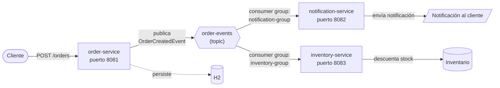

# kafka-learning-project

Proyecto de aprendizaje para practicar **Apache Kafka con Spring Boot**, simulando un sistema de eventos de pedidos de una tienda online.

## Objetivo

Entender los fundamentos de Kafka (productores, consumidores, consumer groups, topics) a través de un ejemplo canónico y simple, antes de evolucionar hacia un proyecto más funcional.

## Arquitectura

Un `order-service` publica eventos `OrderCreatedEvent` en un topic de Kafka. Dos consumidores independientes (`notification-service` e `inventory-service`) escuchan ese mismo evento, cada uno con su propio `group-id`, para reaccionar de forma desacoplada.



- **`order-service`** (productor): dueño del dominio "pedidos". Crea el pedido y publica el evento.
- **`notification-service`** (consumidor): decide qué notificar al cliente cuando se crea un pedido.
- **`inventory-service`** (consumidor): descuenta stock cuando llega un evento de pedido creado.

### Topic

```
order-events
```

## Estructura del repo

Este es un **monorepo**, pero **no** un proyecto Maven multi-módulo. Cada servicio es un proyecto Spring Boot completamente independiente (su propio `pom.xml`, `mvnw`, `application.properties`), generado tal cual desde [start.spring.io](https://start.spring.io). Lo único que comparten es el espacio en el repositorio, no el build ni clases Java — la comunicación entre ellos es exclusivamente a través de eventos de Kafka.

```
kafka-learning-project/
├── docker-compose.yml
├── README.md
├── order-service/
│   ├── pom.xml
│   └── src/main/resources/application.properties
├── notification-service/
│   ├── pom.xml
│   └── src/main/resources/application.properties
└── inventory-service/
    ├── pom.xml
    └── src/main/resources/application.properties
```

## Stack

- Java 17
- Spring Boot 3.5.13
- Spring for Apache Kafka (`spring-kafka`)
- Lombok
- H2 (solo en `order-service`, para persistir pedidos)
- Docker / Docker Compose (Kafka en modo **KRaft**, sin Zookeeper)
- Kafka UI (para inspeccionar topics y mensajes)

GroupId común: `com.ciberaccion`

## Servicios y puertos

| Servicio              | Rol        | Puerto | group-id            |
|-----------------------|------------|--------|----------------------|
| `order-service`       | Productor  | 8081   | —                    |
| `notification-service`| Consumidor | 8082   | `notification-group` |
| `inventory-service`   | Consumidor | 8083   | `inventory-group`    |

## Levantar el entorno

### 1. Infraestructura (Kafka + Kafka UI)

Desde la raíz del repo:

```bash
docker-compose up -d
```

Verifica que el broker esté sano:

```bash
docker-compose ps
```

Kafka UI queda disponible en `http://localhost:8085` (se dejó el 8080 libre a propósito).

### 2. Cada servicio

Desde la carpeta de cada servicio:

```bash
./mvnw spring-boot:run
```

Los tres se conectan a Kafka en `localhost:9092`. Los topics se crean automáticamente al primer uso (`auto-create-topics` habilitado).

## Estado actual

- [x] Estructura del monorepo con los tres servicios independientes
- [x] `pom.xml` corregido a Spring Boot 3.5.13 en los tres servicios
- [x] `docker-compose.yml` con Kafka (KRaft) + Kafka UI
- [x] Puertos y `application.properties` corregidos
- [ ] Clase `OrderCreatedEvent`
- [ ] Productor (`KafkaTemplate`) en `order-service`
- [ ] Consumidores (`@KafkaListener`) en `notification-service` e `inventory-service`
- [ ] Endpoint REST en `order-service` para crear pedidos
- [ ] Persistencia del pedido con JPA/H2

## Notas de diseño

- Se optó por monorepo con proyectos independientes (no multi-módulo Maven) para preservar el desacoplamiento real entre servicios — evita la tentación de compartir clases Java directamente en vez de comunicarse por eventos, que es justo lo que se busca practicar.
- Cada consumidor usa un `group-id` distinto para que ambos reciban el mismo evento de forma independiente (broadcast entre consumer groups).
